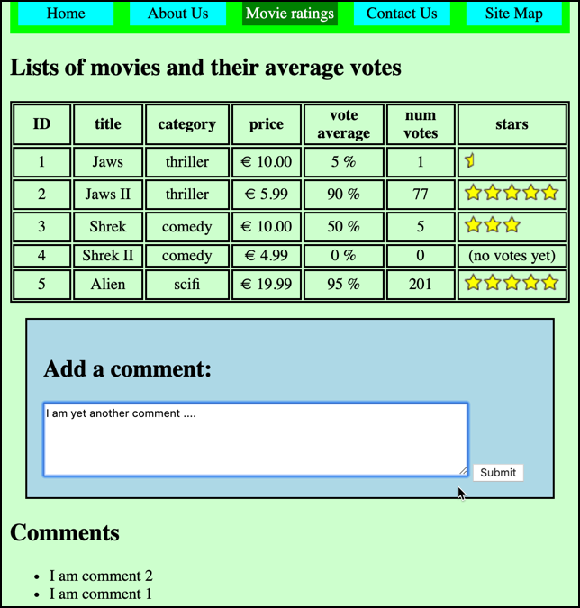

# evote-movie-2020-22-public-comments


Let's add a feature allowing public (non-logged-in) users to post comments on the movie list page.



- first we need to create an Entity class `Comment` to store the text comments users can create. This is a simple entity, it just needs an `id` and a text `comment` properties, the SQL table creation string, and getters/setters for each property: 

    ```php
    <?php
    namespace Tudublin;
        
    class Comment
    {
        const CREATE_TABLE_SQL =
            <<<HERE
    CREATE TABLE IF NOT EXISTS comment (
        id integer PRIMARY KEY AUTO_INCREMENT,
        comment text
    )
    HERE;
    
        private $id;
        private $comment;
    
        ... plus setters / getters for properties "id" and "comment" ...function 
    ```

- we will also need a Repository class to facilitate DB actions on `Comment` objects:

    ```php
    <?php
    namespace Tudublin;
    
    use Mattsmithdev\PdoCrudRepo\DatabaseTableRepository;
    
    class CommentRepository extends DatabaseTableRepository
    {
          // no methods needed - all the work is done through reflection by the DatabaseTableRepository class ...
    }
    ```
  
- we can add a form for creating comments to be displayed after the list of movies in template `/templates/list.html.twig`:

    ```twig
            ... loop to display movies here ...
            
    
        </table>
    
        
            <a href="/index.php?action=newMovieForm">CREATE a new movie</a>
        
    
        <form method="post" action="/" id="commentForm">
            <h2>Add a comment:</h2>
            <input type="hidden" name="action" value="processComment">
            <textarea name="comment" cols="100" rows="10"></textarea >
            <input type="submit">
        </form>
    
    
    ```
  
- let's also make it look nice with some CSS added to '/public/css/basic.css' - we added an ID `commentForm` which we can target with a CSS rule:

    ```css
    ... previous contents of basic.css unchanged ...
    
    #commentForm {
        border: 0.1rem solid black;
        margin: 1rem;
        padding: 1rem;
        background-color: lightblue;
    }
    ```
  
- since we have several Repositories, and they are being used in different controllers, it is useful now to add instance variables for each Repository object to our superclass `Controller`, and initialise then in the construction method:
    
    ```php
    <?php
    namespace Tudublin;
    
    class Controller
    {
        const PATH_TO_TEMPLATES = __DIR__ . '/../templates';
        protected $twig;
    
        protected $movieRepository;
        protected $commentRepository;
        protected $userRepository;   
    
        public function __construct()
        {
            $this->twig = new \Twig\Environment(new \Twig\Loader\FilesystemLoader(self::PATH_TO_TEMPLATES));
            $this->twig->addGlobal('session', $_SESSION);
    
            $this->movieRepository = new MovieRepository();
            $this->commentRepository = new CommentRepository();
            $this->userRepository = new UserRepository();
        }
    }
    ```
  
    - NOTE: we have to make the instance variables of our superclass `protected`, to allow them to be accessed by our controller sub-classes. Since `private` means that a variable can **only** be accessed in the class in which it is declared.
  
- we have to update our `AdminController` to make use of the instance variable `$userRepository` inherited from `Controller`:

    ```php
    class AdminController extends Controller
    {
        public function newUserForm()
        {
            ... as before ...
        }
    
        public function processNewUser()
        {
            $username = filter_input(INPUT_POST, 'username');
            $password = filter_input(INPUT_POST, 'password');
    
            $user = new User();
            $user->setUsername($username);
            $user->setPassword($password);
    
            $this->userRepository->create($user);
    
            $movieController = new MovieController();
            $movieController->listMovies();
        }
    }
    ```

- we can remove the constructor and instance variable `$movieRepository` from class `MovieController`, since this will now be inherited from superclass `Controller`:

    ```php
    class MovieController extends Controller
    {
        // --- instance variable and constructor removed ---
    
        public function listMovies()
        {
            $movies = $this->movieRepository->findAll();
    
            $template = 'list.html.twig';
        .... as before
    }
    ```
  
- let's create a `MainController` method to create a new comment from the recieved form variables:

```php
class MainController extends Controller
{
    public function processNewComment()
    {
        $commentText = filter_input(INPUT_POST, 'comment');

        // only create a comment if it's not an empty string
        if(!empty($commentText)) {
            $comment = new Comment();
            $comment->setComment($commentText);
            $this->commentRepository->create($comment);
        }

        // display list of movies (and comments)
        $movieController = new MovieController();
        $movieController->listMovies();
    }
```
    
- we need to add a new case statement in `WebApplication` to detect when a comment is being submitted with POST action = `createComment` (from our hidden form variable):
    
    ```php
    private function defaultFunctions($action)
    {
        switch ($action) {
            case 'processComment':
                $this->mainController->processNewComment();
                break; 
                
            case 'processLogin':
                $this->loginController->processLogin();
                break;
    
            case 'logout':
                $this->loginController->logout();
    
            ... other cases as before ...
    ```

- we now add to the `listMovies()` method of `MovieController` statements so that an array of comments is passed to the `list.html.twig` template, as well as a list of movies. We will also **reverse** the comments array, so that the most recently added comments (i.e. higher number IDs) are earlier in the list:

    ```php
    class MovieController extends Controller
    {
        public function listMovies()
        {
            $movies = $this->movieRepository->findAll();
            $comments = $this->commentRepository->findAll();
    
            // reverse array - so most recent comments appear first ...
            $comments = array_reverse($comments);
    
            $template = 'list.html.twig';
            $args = [
                'movies' => $movies,
                'comments' => $comments
            ];
            $html = $this->twig->render($template, $args);
            print $html;
        }
    
        ... other methods as before ...
    ```
    
- finally, we need to add some more code to our Twig template `list.html.twig` so that we can loop through the array of comments and display them as a bulleted list:

    ```twig
        ... list movies as before ...
    
        <form method="post" action="/"  id="commentForm">
            <h2>Add a comment:</h2>
            <input type="hidden" name="action" value="processComment">
            <textarea name="comment" cols="75" rows="5"></textarea >
            <input type="submit">
        </form>
    
        {# -------- loop to display comments as list items, if array size > 0 --------#}
        
            <h2>Comments</h2>
            <ul>
                
                    <li>{{ comment.comment }}</li>
                
            </ul>
        
    
    
    ```

- finally, we need to add a fixtures script, to create the Comment table for us. We do this by writing a new script `/db/migrationCommentTable.php`:

    ```php
    <?php
    require_once __DIR__ . '/../vendor/autoload.php';
    
    use Tudublin\CommentRepository;
    use \Tudublin\DotEnvLoader;
    
    // load DB constants from DOTENV
    $dotEnvLoader = new DotEnvLoader();
    $dotEnvLoader->loadDBConstantsFromDotenv();
    
    $commentRespository = new CommentRepository();
    
    // (1) drop then create table
    $commentRespository->dropTable();
    $commentRespository->createTable();
    
    // (2) delete any existing objects
    $commentRespository->deleteAll();
    ```
  
